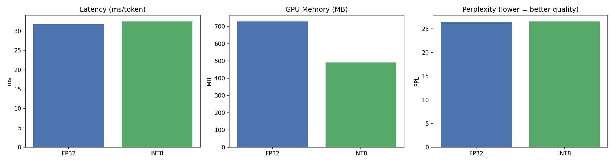

# LLM Inference Optimization: Quantization Benchmarking

Benchmarking the latency / memory / quality trade-off when compressing a GPT-2 language model with 8-bit quantization.

## Motivation

Large language models are expensive to run: they need a lot of memory and compute at inference time. One common way to make deployment cheaper is **quantization** — reducing the numerical precision of the model's weights (e.g. from 32-bit floats to 8-bit integers). This project measures, with real numbers, what you gain (memory, speed) and what you lose (output quality) when you do this to GPT-2.

## What this project does

1. Loads a pretrained GPT-2 model (124M parameters, via HuggingFace `transformers`)
2. Measures baseline **inference latency**, **GPU memory usage**, and **perplexity** (a standard measure of language modeling quality — lower is better) on the WikiText-2 dataset
3. Applies **8-bit quantization** using `bitsandbytes`
4. Re-measures the same three metrics on the quantized model
5. Produces a comparison table and plots
6. Sanity-checks that generated text is still coherent after quantization

## Results

*(Fill in after running `llm_inference_optimization.ipynb` — see `results.csv` and `comparison_plot.png` generated by the notebook.)*

| Model | Latency (ms/token) | Memory (MB) | Perplexity |
|---|---|---|---|
| FP32 (baseline) | — | — | — |
| INT8 (quantized) | — | — | — |



## How to run

The notebook is designed to run in **Google Colab** (free GPU, zero local setup):

1. Open `llm_inference_optimization.ipynb` in Colab
2. `Runtime > Change runtime type > T4 GPU`
3. `Runtime > Run all`

To run locally instead, you need a CUDA-capable GPU:

```bash
pip install torch transformers datasets bitsandbytes accelerate matplotlib pandas
jupyter notebook llm_inference_optimization.ipynb
```

## Project structure

```
.
├── llm_inference_optimization.ipynb   # main notebook: benchmarking pipeline
├── results.csv                        # generated after running (metrics table)
├── comparison_plot.png                # generated after running (bar charts)
└── README.md
```

## Method notes

- **Latency** is measured as average wall-clock time per generated token, over 10 runs, after 3 warmup runs (to exclude CUDA kernel compilation overhead from the measurement).
- **Memory** is peak GPU memory allocated during generation, measured via `torch.cuda.max_memory_allocated()`.
- **Perplexity** is computed with the standard sliding-window method on a held-out slice of WikiText-2.
- The FP32 model is explicitly deleted and GPU memory cleared before loading the quantized model, so memory measurements aren't contaminated by both models being resident at once.

## Possible extensions

- Compare 8-bit vs 4-bit quantization
- Add structured pruning (removing attention heads) as a second compression method
- Test on a larger model (`gpt2-medium`, `gpt2-large`) where quantization gains are typically larger
- Benchmark on CPU (ONNX Runtime) instead of GPU, for edge-deployment scenarios

## License

MIT
